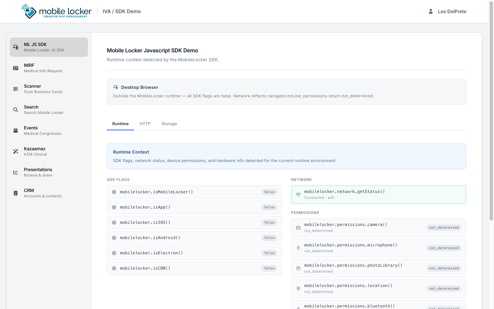
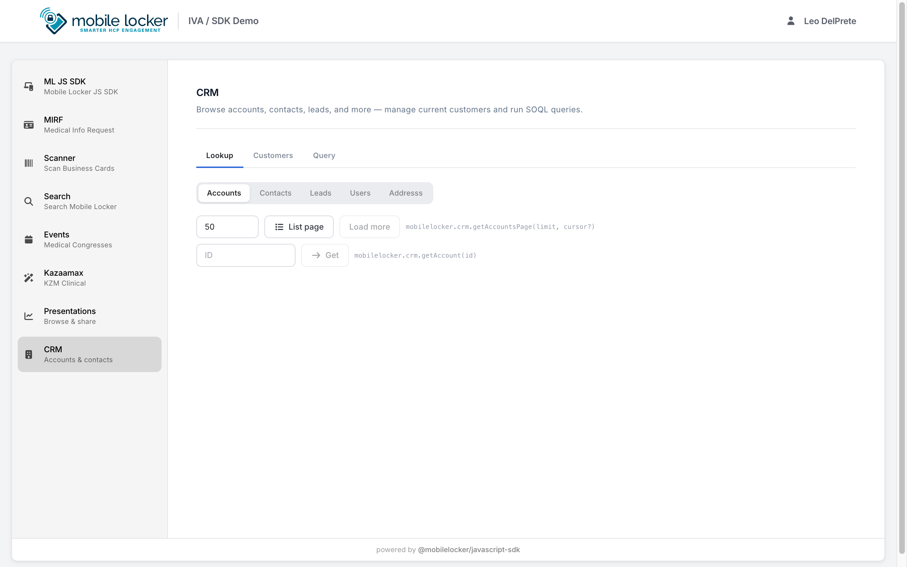
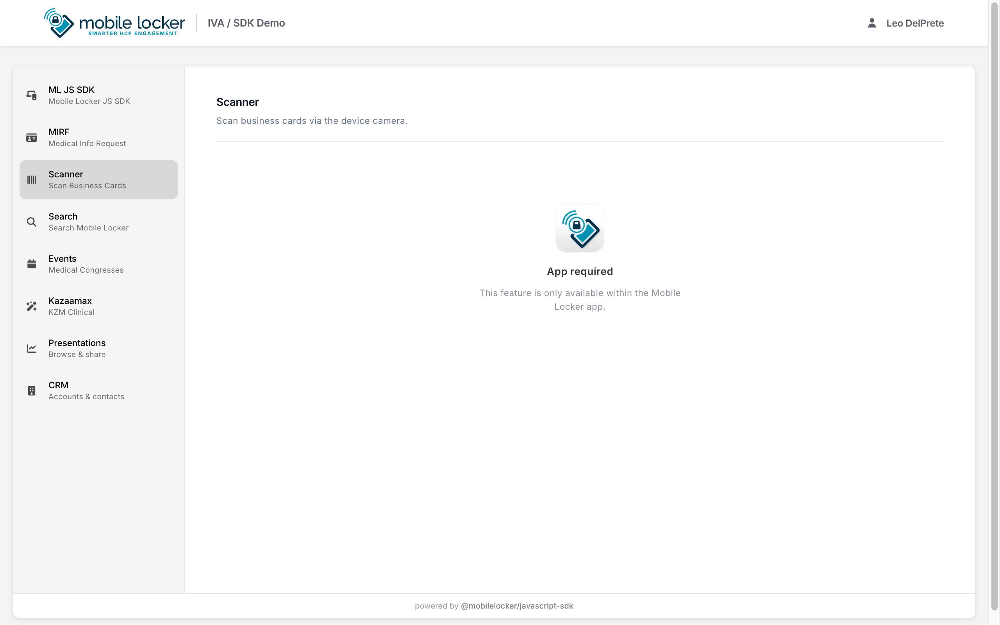
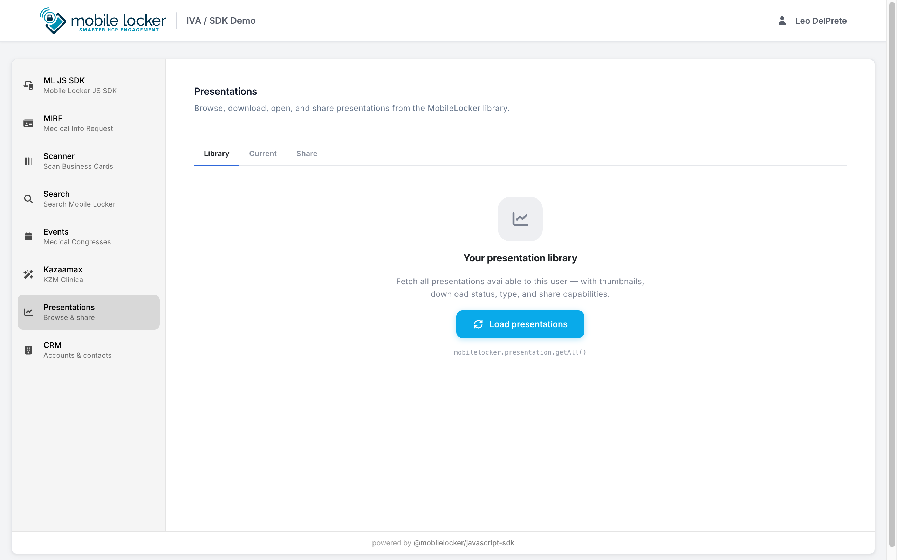

import { LinkCard, CardGrid } from '@astrojs/starlight/components';

The **Mobile Locker SDK Demo** is an Interactive Visual Aid (IVA) built to show developers how to use `@mobilelocker/javascript-sdk` effectively **inside the Mobile Locker iOS app** (and other host shells) — not as a standalone website.

| | |
|--|--|
| **Source & issues** | **[github.com/mobilelocker/mobilelocker-sdk-demo](https://github.com/mobilelocker/mobilelocker-sdk-demo)** |
| **Stack** | Vue 3, Vuetify, Vite, Vue Router (hash history) |
| **SDK** | `@mobilelocker/javascript-sdk` (same major as this package) |
| **How to use it** | Open the demo presentation **in the Mobile Locker app** |

:::note[Companion, not embedded]
This documentation site is static. The demo is a **real presentation** that must run under Mobile Locker so bridge APIs (`crm`, `scanner`, `user`, …) work. Read the docs for contracts; open the demo IVA in the **app** to feel the host APIs. Browse the [GitHub repo](https://github.com/mobilelocker/mobilelocker-sdk-demo) for source and contribution history.
:::

## How to use the demo

1. Install / open the **Mobile Locker** app (iOS is the primary target for scanner and many bridge features).  
2. Open your team’s **SDK Demo** presentation (your admin publishes it like any other IVA; staging teams often use presentation id **37976**).  
3. Use the side nav (or mobile tab bar) to switch screens.  
4. Match what you see to the domain guides below when you need the full API contract.

:::tip[Deep links inside the IVA]
Routes use **hash history**. Once the presentation is open in the app, fragments such as `#/crm` or `#/scanner` jump to a screen.
:::

Do **not** treat a bare browser tab as the supported way to learn the demo. Outside the host, flags stay false, CRM lists stay empty, and screens like Scanner correctly show **App required**.

## Source on GitHub

**Repository:** [https://github.com/mobilelocker/mobilelocker-sdk-demo](https://github.com/mobilelocker/mobilelocker-sdk-demo)

Use the repo to:

- Read how the IVA wires `@mobilelocker/javascript-sdk`  
- File issues / follow updates for the demo presentation  
- Contribute changes (packaging and deploy scripts live there)

This docs site does not replace the repo or host a runnable copy of the IVA.

## Screenshots

Layout and navigation of the demo IVA. Captured for orientation only — **run the presentation in Mobile Locker** for real data and device features.

### Environments (`#/mljs`)



### CRM (`#/crm`)

Cursor-paged lookup UI (`getAccountsPage` / List page / Load more):



### Scanner (`#/scanner`)

Outside the app the screen gates correctly; in the iOS app you get the native scanners:



### Presentations (`#/presentation`)



## What you can explore

| Demo screen | Route | What it shows | Read in docs |
|-------------|-------|---------------|--------------|
| **ML JS SDK** (environments) | `#/mljs` | `isIOS` / `isApp` / network / permissions / device / toolbar | [Environments](../guides/environments/) · [Device](../domains/device/) · [Permissions](../domains/permissions/) · [Network](../domains/network/) · [UI](../domains/ui/) |
| **CRM** | `#/crm` | SOQL query, current customers, picker, refresh, **cursor-paged** entity walks | [CRM](../domains/crm/) · [Errors](../domains/errors/) |
| **Scanner** | `#/scanner` | Business card / badge scan (iOS) | [Scanner](../domains/scanner/) · [Congresses](../domains/congresses/) |
| **Search** | `#/search` | Cross-entity search | [Search](../domains/search/) |
| **Presentations** | `#/presentation` | Current presentation, library, open / download | [Presentation](../domains/presentation/) |
| **Events** | `#/events` | Session / device events | [Session](../domains/session/) · [Presentation](../domains/presentation/) |
| **MIRF** | `#/mirf` | Form capture patterns | [Data](../domains/data/) · [Share](../domains/share/) |
| **Kazaamax** | `#/kazaamax` | Sample product / content flow | [Data](../domains/data/) · [Analytics](../domains/analytics/) |

## How this relates to these docs

```
┌─────────────────────────────────────┐
│  Starlight docs                     │
│  Guides · Domains · API reference   │
└─────────────────┬───────────────────┘
                  │  explains / deep-links
                  ▼
┌─────────────────────────────────────┐
│  SDK Demo IVA (in Mobile Locker)    │
│  Screens → host bridge APIs         │
└─────────────────┬───────────────────┘
                  ▲
                  │  source of truth for the IVA
┌─────────────────┴───────────────────┐
│  github.com/mobilelocker/           │
│  mobilelocker-sdk-demo              │
└─────────────────────────────────────┘
```

| Goal | Use |
|------|-----|
| Understand an API | Domain guide + [API reference](../api/) |
| See UI + host behavior | Demo IVA **in the Mobile Locker app** |
| Read / contribute demo source | [mobilelocker-sdk-demo on GitHub](https://github.com/mobilelocker/mobilelocker-sdk-demo) |
| Ship your own IVA | [Install](../guides/install/) · [Getting started](../guides/getting-started/) · patterns from the demo repo |

## Version alignment

Keep the demo’s `@mobilelocker/javascript-sdk` dependency on the **same major** as this package so screens and domain guides describe the same methods (`eachPage` / `get*Page` / `crm.query`, and so on).

## Related docs

<CardGrid>
	<LinkCard title="Getting started" href="../guides/getting-started/" />
	<LinkCard title="CRM" href="../domains/crm/" />
	<LinkCard title="Scanner" href="../domains/scanner/" />
	<LinkCard title="Environments" href="../guides/environments/" />
	<LinkCard title="Changelog" href="../guides/changelog/" />
</CardGrid>
